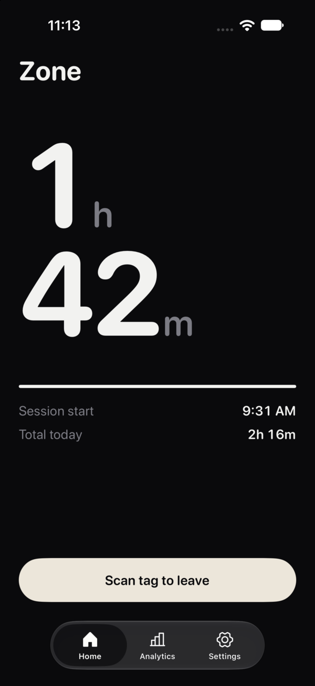
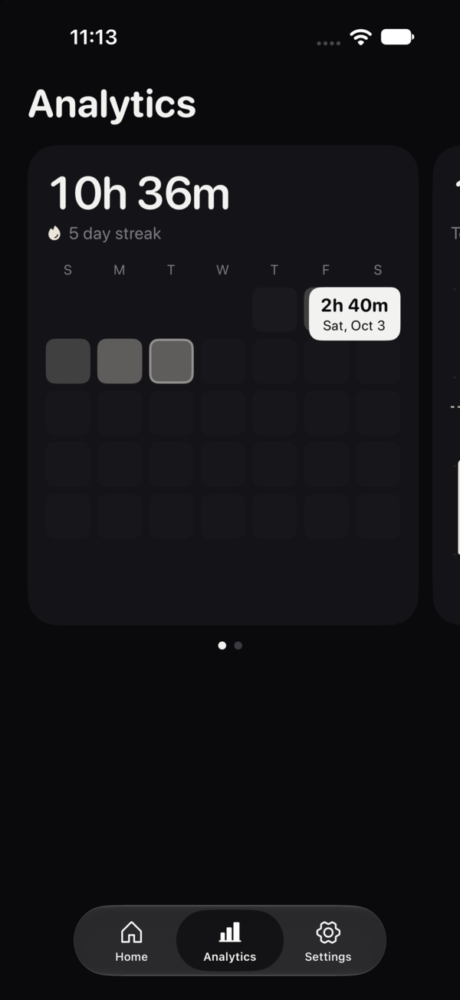
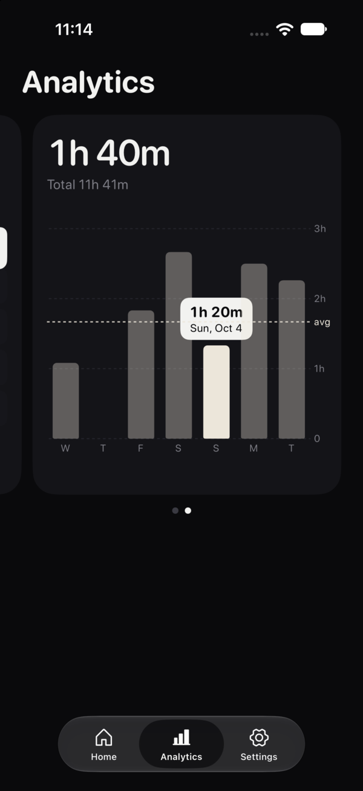
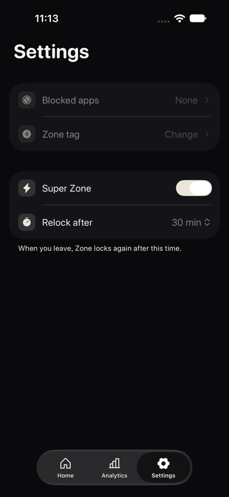

# Zone

Zone is an app blocker for iPhone. Tap a button to enter the Zone, and the apps you chose are blocked. To leave, you must scan your NFC tag.

<p>
  
  
  
  
</p>

## Features

- Blocks apps and websites with Screen Time.
- Leave only with your own tag. Zone checks the tag chip ID, so a copy of the sticker does not work.
- Super Zone locks again some minutes after you leave, also when the app is closed.
- Analytics shows your time in the Zone for each day of the month and for the last 7 days. Tap a day to see its total.

## Build

Zone needs Xcode, XcodeGen and a paid Apple developer account (Screen Time and NFC need it).

```sh
xcodegen generate
open Zone.xcodeproj
```

Icons are from [Phosphor](https://phosphoricons.com) (MIT).
